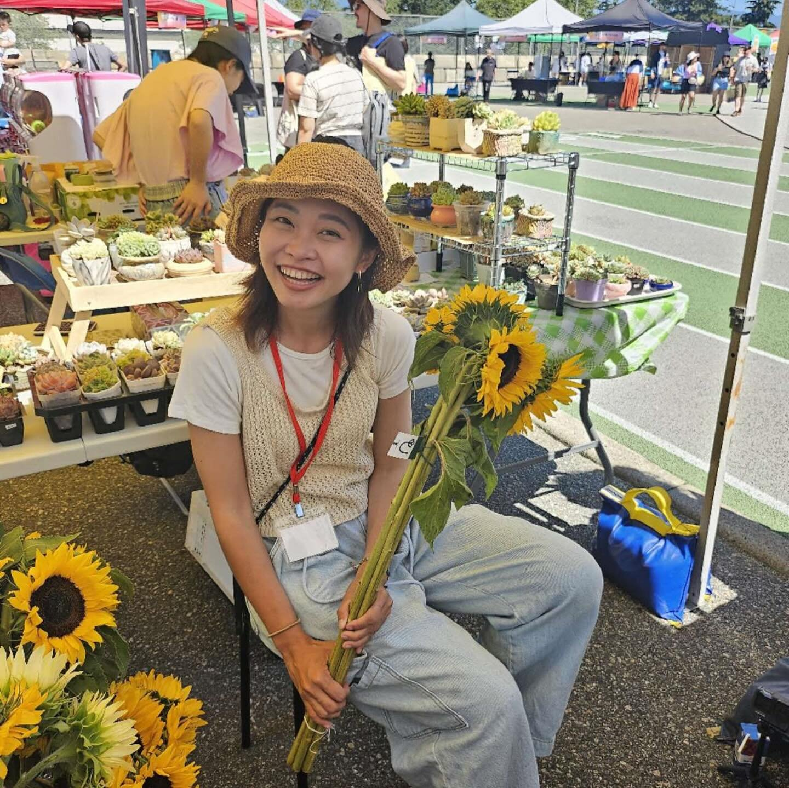
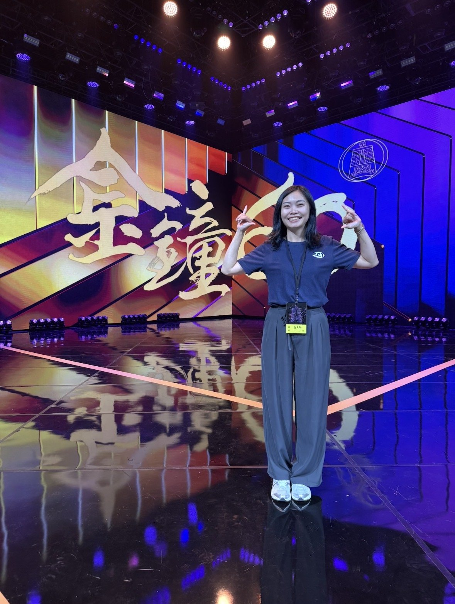
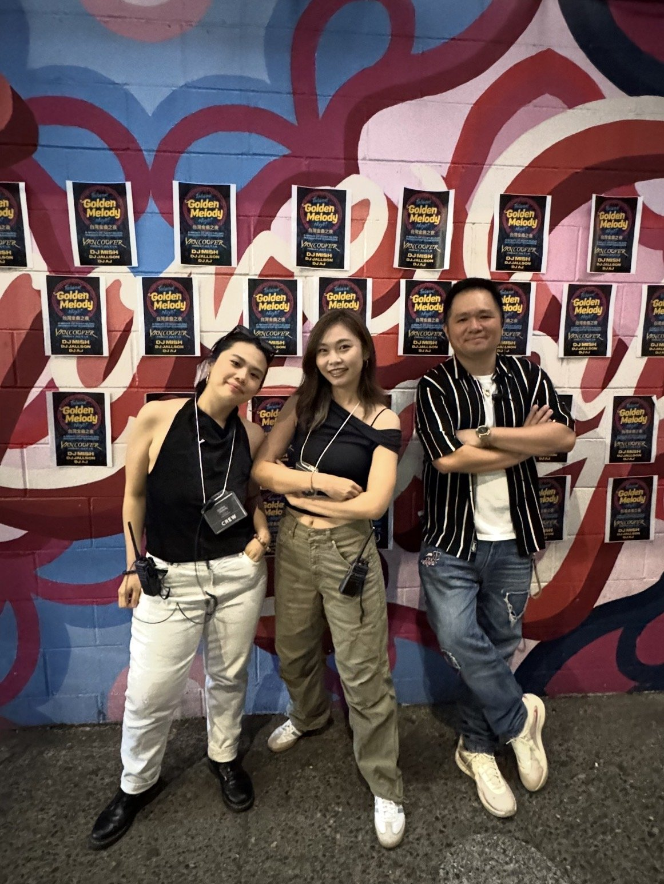
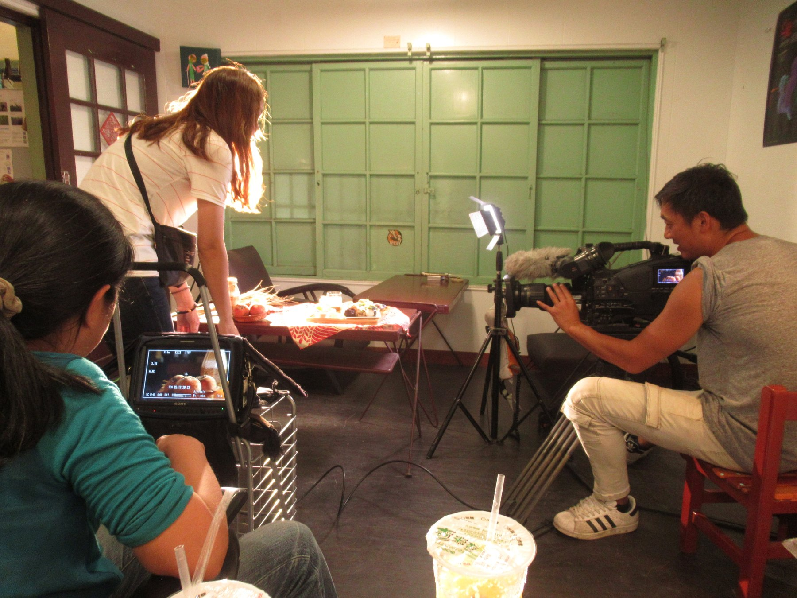
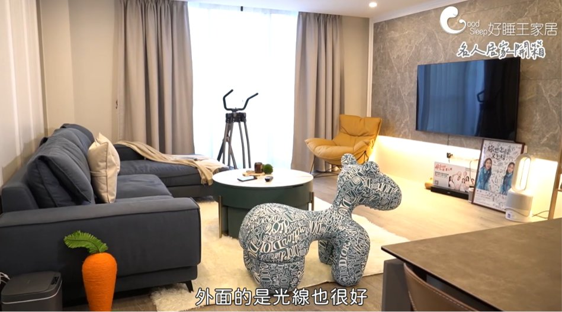
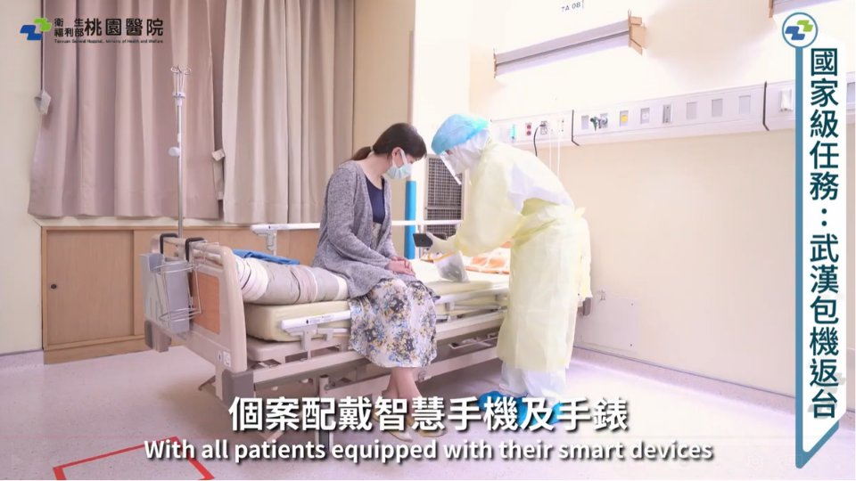
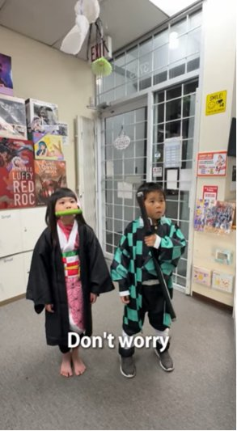
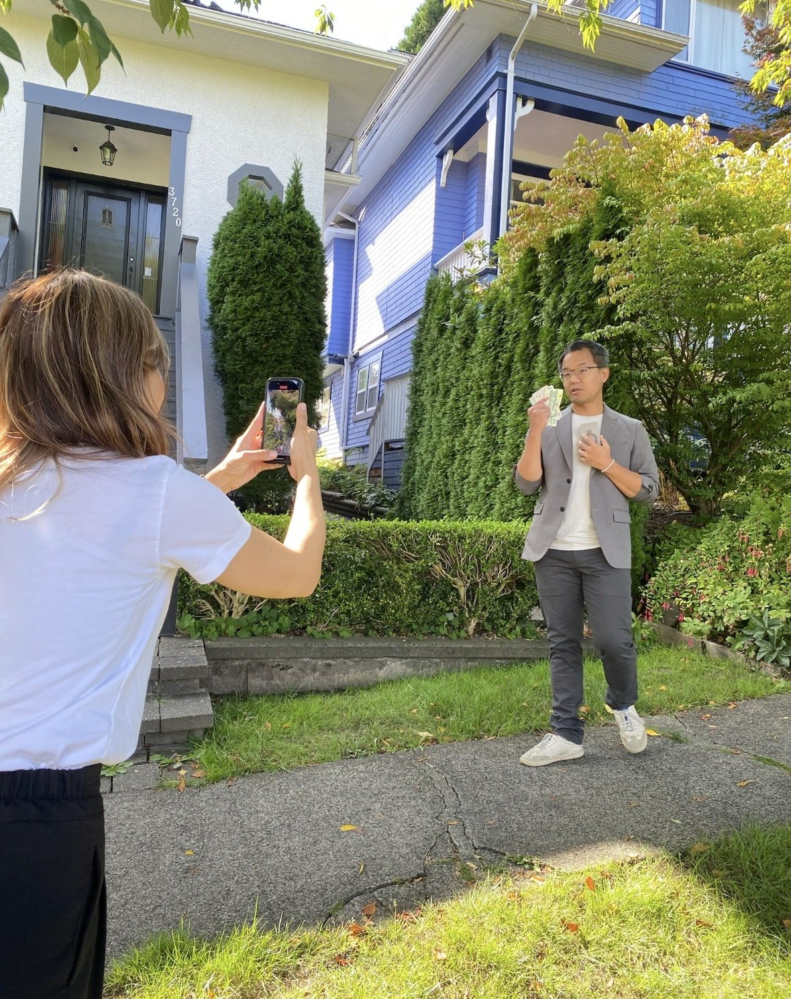
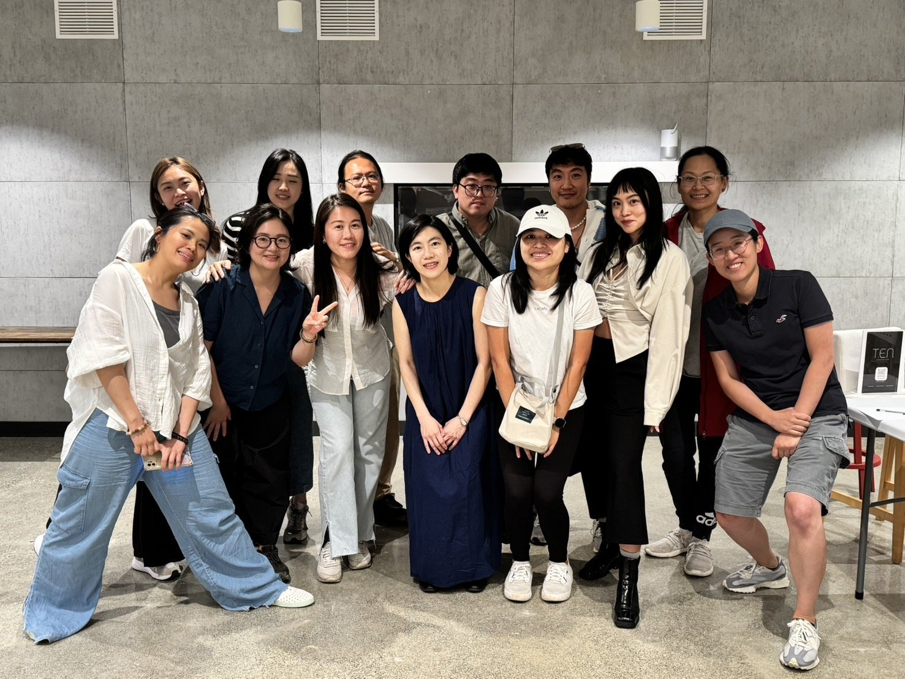

<!DOCTYPE html>
<html lang="zh-Hant">
<head>
<meta charset="UTF-8">
<meta name="viewport" content="width=device-width, initial-scale=1.0">
<title>廖亭琇 Donna Liao — Storyteller & Content Producer</title>
<link rel="preconnect" href="https://fonts.googleapis.com">
<link rel="preconnect" href="https://fonts.gstatic.com" crossorigin>
<link href="https://fonts.googleapis.com/css2?family=Fraunces:ital,opsz,wght@0,9..144,300;0,9..144,400;0,9..144,500;0,9..144,600;1,9..144,400;1,9..144,500&family=Inter:wght@300;400;500;600;700&family=Noto+Serif+TC:wght@400;500;600;700&family=Noto+Sans+TC:wght@300;400;500;600;700&display=swap" rel="stylesheet">

</head>
<body data-lang="zh">

<header>
  

    
廖亭琇 / Donna Liao

    

      <nav>
        <ul>
          <li><a class="nav-link" href="#about">關於我About</a></li>
          <li><a class="nav-link" href="#journey">職涯歷程Journey</a></li>
          <li><a class="nav-link" href="#skills">專長Skills</a></li>
          <li><a class="nav-link" href="#works">精選活動Highlights</a></li>
          <li><a class="nav-link" href="#contact">聯絡我Contact</a></li>
        </ul>
      </nav>
      <button id="langToggle">EN中文</button>
    

  

</header>

<!-- ================= HERO / QUICK PITCH ================= -->
<section class="hero" id="home">
  

    

      影音行銷 · 內容製作 · 溫哥華
      Video Marketing · Content Production · Vancouver
    

    <h1>
      Donna Liao，用影像挖掘故事的人。
      Donna Liao. I dig for the story through imagery.
    </h1>
    

      10 年外景節目企劃、編導與影音統籌經驗
      10 years in on-location TV production, directing, and content strategy
    

    

      

        善於「挖掘受訪者深度故事」並轉化為高轉換率的影像、文字內容，曾導線下百萬導流營收。從台灣電視台到溫哥華的品牌與電商現場，我用同一套敏銳度說每一個故事。
        Skilled at uncovering the deeper story inside every interview and turning it into high‑converting video and written content — work that has driven offline campaigns worth millions in revenue. From Taiwanese television to brand and e‑commerce work in Vancouver, I bring the same instinct to every story I tell.
      

    

    

      <a class="btn btn-solid" href="#works">看精選作品See the work →</a>
      <a class="btn btn-outline" href="#contact">聯絡我Say hello</a>
    

  

</section>

<!-- ================= ABOUT ================= -->
<section id="about">
  

    
01

    <h2 class="section-title">
      探索世界、挑戰未知的影音行銷人
      A storyteller who explores the world and embraces the unknown
    </h2>

    

      

        

          
          照片位置 · 待放入Portrait placeholder
        

        
<b>廖亭琇 Donna Liao</b> 
          影音企劃、編導與內容行銷 · 現居溫哥華
          Video Producer & Content Strategist · Based in Vancouver
        

      

      

        
哈囉～我是廖亭琇！我是一個活潑熱情、對生活充滿好奇心的人。我熱愛探索世界，總是背著包包到處旅行與攝影，並透過社群記錄生活。對我而言，工作與生活一樣，都是不斷突破、讓視野更開闊的舞台。

        
Hi, I'm Donna! I'm an outgoing, curious person who loves exploring the world — always traveling with a backpack and a camera, documenting life along the way. To me, work and life share the same stage: both are about constantly pushing boundaries and widening perspective.

        <h4>💡 從電視台到品牌行銷💡 From TV Studio to Brand Marketing</h4>
        
在媒體與影像領域深耕多年，我習慣在細節中尋找突破。在電視台擔任企劃期間，我熱衷於發掘人物深層的故事，曾被主管與同事稱讚擁有「精準挖掘受訪者不同面向」的敏銳度。我甚至曾勇於跨界，在鏡頭前與資深藝人同台對戲！因為渴望作品不斷創新，我自學剪輯與編導，逐漸蛻變為能獨立主導影像作品的創作者。隨後，我將這份說故事的能力帶入家居產業。身為社群行銷影音企劃，我為新創品牌開拓社群全方位管道，並成功建立標準化影音工作流、規劃攝影棚、帶領團隊；同時也負責口碑行銷企劃，規劃 KOL/KOC 內容、撰寫品牌文章、廣告素材，甚至參與新品牌開發、門市行銷與裝潢服務專案，成功為傳統家居品牌拓展新市場，並創造百萬營收。

        
I've spent years deep in media and video production, always looking for the breakthrough hidden in the details. As a programming producer at a TV station, I loved uncovering the layered stories behind the people I interviewed — colleagues and supervisors often praised my instinct for drawing out different facets of an interviewee. I even stepped in front of the camera to act alongside veteran performers. Driven by a hunger to keep my work fresh, I taught myself editing and directing, growing into a creator who could independently lead a video production from start to finish. I later brought that storytelling instinct into the home‑furnishings industry — building a brand's social channels from the ground up, establishing a standardized video workflow, planning a studio, and leading a team, while also running word‑of‑mouth marketing, KOL/KOC content, brand copywriting, and new‑product launches. That work helped a traditional furniture brand break into new markets and generated millions in revenue.

        <h4>✈️ 跨越國界：加拿大的數位行銷與電商實踐✈️ Crossing Borders: Digital Marketing & E-Commerce in Canada</h4>
        
為了追求更深度的行銷技能，我來到加拿大進修 Digital Marketing Co-op 課程。在這裡，我的適應力與熱情讓我快速融入在地——接觸了食品貿易、餐飲與服務零售業，熟練掌握現場銷售與 Shopify POS 電商系統；同時也以自由接案者的身份，協助當地店家經營社群、拍攝剪輯短影音、打造內容 IP。這段豐富的海外實務經驗，讓我對跨境品牌運營與國際化市場行銷有了更接地氣的理解。

        
To deepen my marketing skill set, I moved to Canada to complete a Digital Marketing Co‑op program. My adaptability and enthusiasm helped me settle in quickly — working across food trade, food service, and retail, and mastering in‑person sales and the Shopify POS system. As a freelancer, I also helped local businesses manage social media, shoot and edit short‑form video, and build content IP. This hands‑on experience gave me a grounded understanding of cross‑border brand operations and international marketing.

        <h4>🌱 我的核心價值🌱 My Core Values</h4>
        
我不只熱愛創作，更擅長團隊溝通、流程規劃、拆解問題，不怕接觸新鮮事物，也願意從零學習，並樂於打造充滿創意與熱情的工作氛圍。

        
I don't just love creating — I'm skilled at team communication, process planning, and breaking problems down. I embrace new challenges, learn from scratch when I need to, and love building a work environment full of creativity and energy.

      

    

  

</section>

<!-- ================= SKILLS ================= -->
<section class="section-alt" id="skills">
  

    
02

    <h2 class="section-title">專長 工具箱Tools I reach for</h2>
    

      

        <h4>影音與行銷工具Production & Marketing Tools</h4>
        

          Adobe Premiere
          CapCut
          Shopify
          Canva
          QuickBooks
          POS
        

      

      

        <h4>軟實力People & Process</h4>
        

          中文（母語）Mandarin (Native)
          現金管理Cash Handling
          客戶服務Customer Service
          溝通協作Communication
          跨領域轉換力Transferable Skills
        

      

    

  

</section>

<!-- ================= JOURNEY / TIMELINE ================= -->
<section id="journey">
  

    
03

    <h2 class="section-title">經歷Experience</h2>
    

      從電視台外景現場到品牌與電商線上線下，每一段經歷成就多元跨領域的我。
      From on‑location TV production to brand and e‑commerce work, online and offline — every chapter has shaped who I am today: multi‑disciplinary and cross‑industry.
    

    

      

      

        

        
2010 – 2013

        <h3 class="tl-role">實習與志工經驗Practicum & Volunteer Work</h3>
        

          私立台大幼稚園助教；台南下營國小台語教學實習。
          Teaching assistant at a private NTU‑affiliated kindergarten; Taiwanese‑language teaching practicum at Xiaying Elementary School, Tainan.
        

      

      

        

        
2013

        <h3 class="tl-role">三立電視節目部 — 專案執行組SET TV Program Dept. — Project Execution</h3>
        

          活動發想與執行，操作過「愛台客APP」、「達人校園演講」等大型活動。
          Conceived and executed large‑scale activations including the "iTaike App" launch and campus speaker tours.
        

      

      

        

        
2013.09 – 2020.11

        <h3 class="tl-role">三立電視節目部《草地狀元》— 企劃／編導SET TV "Rural Hero" — Planner / Director</h3>
        

          與主持人黃西田合作，走遍全台記錄各行各業職人的堅持與打拼故事。負責題材構思與電訪、腳本撰寫、現場溝通與執行、行程安排、客戶專案執行、電商平台人物故事撰寫、社群（FB／IG）經營、新聞稿撰寫、財務管理與剪輯；亦操作政府與企業的節目置入合作。
          Worked alongside host Huang Hsi‑tien on a long‑running program spotlighting everyday craftsmen across Taiwan. Owned story research and phone interviews, scriptwriting, on‑location coordination, scheduling, client‑project execution, e‑commerce storytelling, social media (FB/IG), press releases, budgeting, and editing — plus government and brand product‑placement partnerships.
        

      

      

        

        
2020.11 – 2021

        <h3 class="tl-role">自由接案 — 童心力有限公司Freelance Producer — Tong Xin Li Co., Ltd.</h3>
        

          協助各項標案節目發想、寫案，並擔任編導、剪輯。代表作品：兒童節目《媒體，有事嗎?》重製與預告剪輯暨巡迴講座助理講師；台中地政局農地農用宣傳影片編導；桃園署立醫院專案企劃拍攝；「亞洲橋王」黃光輝人物形象專訪編導。
          Proposed, wrote, directed, and edited bids for children's and public‑sector programming. Highlights: remaster & trailer edit of children's program "Media, What's the Problem?" plus touring assistant lecturer; farmland‑use PSA for the Taichung Land Administration Bureau; project planning and filming for Taoyuan General Hospital; profile interview of martial artist Huang Kuang‑hui, "Asia's Bridge King."
        

      

      

        

        
2021 – 2024

        <h3 class="tl-role">好睡王家居 — 影音企劃、編導Hausen Home Furnishings — Video Producer & Director</h3>
        

          負責品牌媒體平台、影音、平面與口碑行銷；藝人 KOL/KOC 接洽與合作內容發想，撰寫產業文章、社群文案，並執行客戶與藝人居家訪談。
          Owned the brand's media platform, video, print, and word‑of‑mouth marketing; liaised with KOLs/KOCs, wrote industry articles and social copy, and produced home interviews with clients and celebrities.
        

      

      

        

        
2024

        <h3 class="tl-role">Hobby Bee Canada — 日本公仔店Hobby Bee Canada — Japanese Collectibles</h3>
        

          前台銷售、電商出貨包裝，以及行銷影片拍攝與剪輯。同年參與 2024 全球華人文化節（溫哥華）與 2024 Canada Bubble Tea Festival 志工服務。
          In‑store sales, e‑commerce fulfillment and packaging, and marketing video production. Also volunteered at the 2024 Global Chinese Culture Festival and the 2024 Canada Bubble Tea Festival, Vancouver.
        

      

      

        

        
2025 – 2026

        <h3 class="tl-role">Gohan Trading CompanyGohan Trading Company</h3>
        

          掌握日本食品進口 NPI 報關流程，建立 QuickBooks 檔案系統，深入了解在地進出口產業。
          Managed NPI customs clearance for Japanese food imports and built the company's QuickBooks filing system, gaining hands‑on exposure to the local import/export industry.
        

      

      

        

        
2024 – 2026

        <h3 class="tl-role">社群自由接案 — 溫哥華Independent Social Media Producer — Vancouver</h3>
        

          內容行銷影片構思、腳本、拍攝、剪輯，並協助舉辦活動項目。代表活動：2025 DJ Mish 溫哥華金曲之夜 × Funtasy；2026 華饒金曲嘻年之夜 × Funtasy；2026 台加跨界藝術季；房產經紀形象與知識短影音操作。
          Concepting, scripting, filming, and editing content‑marketing video, plus event production support. Highlights: 2025 DJ Mish Vancouver Golden Melody Night × Funtasy; 2026 Huarao Golden Hits Hip Year Night × Funtasy; 2026 Taiwan‑Canada Cross‑Border Arts Festival; brand and knowledge short‑video production for a real estate agent.
        

      

    

  

</section>

<!-- ================= WORKS / HIGHLIGHTS ================= -->
<section class="section-alt" id="works">
  

    
04

    <h2 class="section-title">精選代表活動Featured Highlights</h2>

    <a class="btn btn-solid" href="https://youtube.com/playlist?list=PL5FWbSDcLhgziWgmIqBlZuT_6peymob8x&si=Jg3bNLP2MK4rwhB1" target="_blank" rel="noopener" style="margin-bottom:50px;">
      觀看作品總集Watch the Showreel Playlist ▶
    </a>

    

      

        

          
          獎項Award
        

        

          <h4>台灣電視金鐘獎Taiwan Television Golden Bell Awards</h4>
          
節目製作團隊參與台灣電視產業年度盛事。Program team participation at Taiwan's leading television industry awards.

        

      

      

        

          
          活動製作Event Production
        

        

          <h4>2025 DJ Mish 溫哥華金曲之夜 × Funtasy2025 DJ Mish Vancouver Golden Melody Night × Funtasy</h4>
          
溫哥華在地音樂活動企劃與內容製作。Concept and content production for a Vancouver live‑music event.

        

      

      

        

          
          幕後花絮Behind the Scenes
        

        

          <h4>三立電視台外景實錄SET TV On‑Location Production Log</h4>
          
七年外景現場的策劃與執行紀錄。Seven years of on‑location planning and production, documented.

        

      

      

        

          
          內容系列Content Series
        

        

          <h4>藝人開箱家居生活Celebrity Home Unboxing</h4>
          
好睡王家居品牌口碑內容系列企劃。Word‑of‑mouth content series produced for Hausen Home Furnishings.

        

      

      

        

          
          公部門專案Public Project
        

        

          <h4>桃園署立醫院專案Taoyuan General Hospital Project</h4>
          
專案企劃、編導拍攝與後期剪輯。Project planning, directing, filming, and post‑production.

        

      

      

        

          
          零售社群Retail & Social
        

        

          <h4>加拿大公仔店短影音宣傳Canada Figure Shop Short‑Video Promo</h4>
          
Hobby Bee Canada 的短影音行銷企劃與剪輯。Short‑form marketing video concept and editing for Hobby Bee Canada.

        

      

      

        

          
          個人品牌Personal Brand
        

        

          <h4>溫哥華房地產經營Vancouver Real Estate Marketing</h4>
          
房產經紀形象建立與知識型短影音操作。Brand building and knowledge‑based short video for a local real estate agent.

        

      

      

        

          
          工作坊Workshop
        

        

          <h4>2025 重複就好：超日常藝術沙龍工作坊2025 "Just Repeat" — Ultra‑Everyday Art Salon Workshop</h4>
          
溫哥華在地藝術沙龍活動企劃與參與。Concept and participation in a Vancouver‑based art salon workshop.

        

      

    

  

</section>

<!-- ================= CONTACT ================= -->
<section id="contact">
  

    
05

    

      

        <h2 class="section-title">我們來聊聊吧Let's make something</h2>
        

          歡迎全職職缺、接案合作，或單純想聊聊內容行銷與說故事的方法。
          Open to full‑time roles, freelance projects, or simply a conversation about content and storytelling.
        

        

          <a href="mailto:sandal255@hotmail.com">✉ sandal255@hotmail.com</a>
          <a href="tel:+17782886632">☎ +1 778‑288‑6632</a>
          <a href="https://www.linkedin.com/in/donna-liao-b39a9018b/" target="_blank" rel="noopener">in linkedin.com/in/donna-liao-b39a9018b</a>
        

      

      

        用故事，串起下一段旅程。
        Stringing the next chapter together, one story at a time.
      

    

  

</section>

<footer>
  

    © 2026 廖亭琇 Donna Liao ・ 於溫哥華用心製作
    © 2026 Donna Liao ・ Built with care in Vancouver
  

</footer>

</body>
</html>
